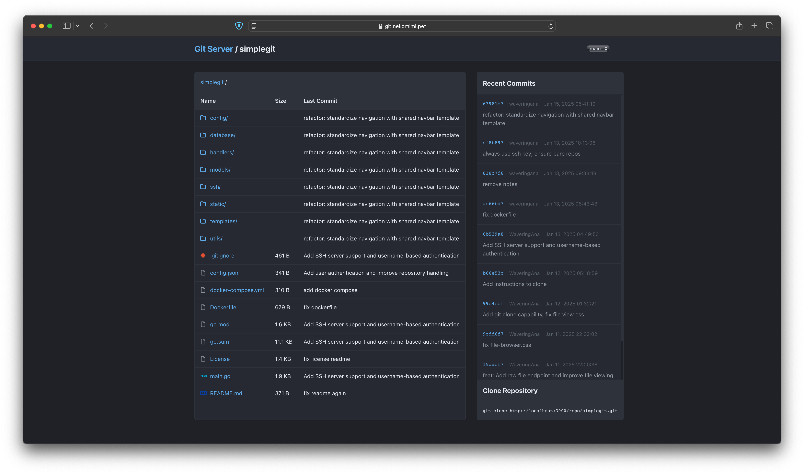
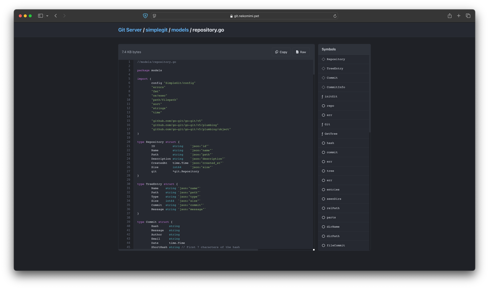

# SimpleGit

SimpleGit is a lightweight, self-hosted Git server written in Go that provides a clean web interface for browsing repositories and Git operations over HTTP and SSH protocols.





## Features

### Web Interface
- Repository browser
- Commit history viewer
- Multi-branch support with branch switching

### Git Operations
- HTTP Git protocol support:
  - Clone, push operations
  - Automatic bare repository handling
- SSH Git protocol support:
  - Public key authentication
  - User-managed SSH key system

### User Management
- Complete user authentication system
- SSH key management
  - Add/remove SSH keys
  - Key fingerprint tracking
  - Per-user SSH key management

### Technical Features
- Backend:
  - Go 1.21+
  - SQLite database for user management
  - GORM for ORM functionality
  - JWT for authentication
  - Gorilla Mux for routing
  - go-git for Git operations
  - Built-in TypeScript service for syntax highlighting
- Frontend:
  - Highlight.js for syntax highlighting

## Quick Start

### Docker Setup (Recommended)

1. Clone the repository:
```bash
git clone https://github.com/yourusername/simplegit.git
cd simplegit
```

2. Create the configuration file:
```bash
cp config.json.example config.json
```

3. Edit `config.json` with your settings

4. Start with Docker Compose:
```bash
docker-compose up -d
```

### Manual Setup

1. Install Go 1.21 or later, Install NodeJS and NPM
2. Clone the repository:
```bash
git clone https://github.com/yourusername/simplegit.git
cd simplegit
```

3. Create the configuration file:
```bash
cp config.json.example config.json
```

4. Edit `config.json` with your settings

5. Build and run:
```bash
go build
./simplegit
```

## Configuration

The server can be configured through environment variables or a JSON config file. Environment variables take precedence over the JSON configuration.

### Environment Variables:

- `SIMPLEGIT_DEV_MODE`: Enable development mode (boolean)
- `SIMPLEGIT_PORT`: HTTP server port
- `SIMPLEGIT_SSH_PORT`: SSH server port (default: 2222)
- `SIMPLEGIT_DATE_FORMAT`: Date format string
- `SIMPLEGIT_MAX_FILE_SIZE`: Maximum file size for web display in bytes
- `SIMPLEGIT_DATA_DIR`: Directory for database and data storage
- `SIMPLEGIT_JWT_SECRET`: Secret key for JWT tokens
- `SIMPLEGIT_DOMAIN`: Server domain name (default: localhost)
- `SIMPLEGIT_SSH_KEY_PATH`: Path to SSH host key
- `SIMPLEGIT_REPO_PATH`: Path to store Git repositories
- `SIMPLEGIT_DB_PATH`: Path to SQLite database file
- `TS_SERVICE_URL`: URL for the TypeScript syntax highlighting service (default: http://localhost:3001)

### Docker Configuration

The included Docker setup provides:
- Single container deployment including both Go and TypeScript services
- Multi-stage build for minimal image size
- Volume mounting for repositories and data
- Environment-based configuration
- Automatic repository directory creation
- Non-root user for security
- Resource limits and reservations

Example docker-compose.yml:
```yaml
version: "3.8"

services:
  simplegit:
    image: ghcr.io/waveringana/simplegit:v0
    ports:
      - "3000:3000"
      - "2222:2222"
    volumes:
      - ./repositories:/app/repositories
      - ./data:/app/data
      - ./ssh:/app/ssh
    environment:
      - SIMPLEGIT_PORT=3000
      - SIMPLEGIT_SSH_PORT=2222
      - SIMPLEGIT_JWT_SECRET=your-secure-secret
      - SIMPLEGIT_DOMAIN=git.yourdomain.com
      - SIMPLEGIT_MAX_FILE_SIZE=10485760
    restart: unless-stopped
    deploy:
      resources:
        limits:
          memory: 768M
        reservations:
          memory: 256M
```

## Initial Setup

1. Start the server for the first time
2. Look for the admin setup token in the console output
3. Visit http://localhost:3000/setup-admin
4. Use the setup token to create the admin account
5. Log in with the admin account
6. Create repositories and users through the admin interface

## Repository Management

### Create a Repository

1. Log in as admin
2. Go to Admin → Repositories
3. Click "Create Repository"
4. Enter repository name and description

### Clone a Repository

HTTP:
```bash
git clone http://localhost:3000/repo/example.git
```

SSH:
```bash
git clone ssh://git@localhost:2222/example.git
```

## Development

### Project Structure

```
simplegit/
├── config/        # Configuration handling
├── database/      # Database initialization
├── handlers/      # HTTP request handlers
├── models/        # Data models and business logic
├── services/      # Additional services (TS worker)
├── ssh/          # SSH server implementation
├── static/       # Static web assets
├── templates/    # HTML templates
└── utils/        # Utility functions
```

### Technology Stack

- Backend:
  - Go 1.21+
  - go-git (Git operations)
  - GORM (ORM)
  - SQLite (Database)
  - Gorilla Mux (Routing)
  - JWT (Authentication)

- Frontend:
  - Highlight.js (Syntax highlighting)

- Services:
  - Built-in TypeScript syntax highlighting service
  - Express.js for TS service API
  - highlight.js for server-side syntax highlighting

## License

This project is released under the Unlicense. See the LICENSE file for details.

## Acknowledgments

Built with these excellent libraries:
- highlight.js - BSD Three Clause License
- htmx - BSD Zero Clause License
- go-git - Apache License 2.0
